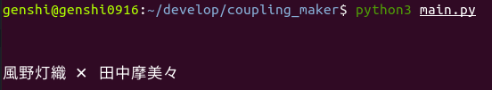

# 12/25です。いかがお過ごしでしょうか。

## はじめに
この素晴らしい聖夜という日にキモオタの思想が詰まっている駄文をインターネットの海に流してしまい申し訳ありません。そしてこの偉大な [「百合 Advent Calendar 2020」](https://adventar.org/calendars/5057) のオオトリをかざるのが僕になってしまい本当に申し訳ありません。後述しますが今日の日付には少々理由がありまして、、まあ反省はしていますが後悔はしていません公開はしてます。はい。

ちなみに僕はいまAmong us をぼっち同級生たち10人とやっています。楽しいです。ああ18歳のクリスマス。

<blockquote class="twitter-tweet"></blockquote> 

## 百合とは
言うまでもないが百合はいい。百合はまだウィルスには効かないがそのうち効くようになるだろう。

さて、近年ウィルスに効くようになるだろうと期待されている百合だが、「百合ってなんなんだろう？？」というかわいそうな人類がいる可能性も考えて軽く紹介しておこう。

百合とは wikipedia先生によると

**百合（ゆり）は、女性の同性愛のこと。また、それを題材とした各種作品。作品の場合、女性同士の恋愛だけでなく恋愛に近い友愛や広く友情を含んだ作品も百合と言うことが多い。** [wikipedia](https://ja.wikipedia.org/wiki/%E7%99%BE%E5%90%88_(%E3%82%B8%E3%83%A3%E3%83%B3%E3%83%AB))より引用

女性が女性を愛するというなんら不思議でないごくごく当たり前、一般的なことである。書く必要さえ、紹介する必要さえなかったような気もする。これくらい一般常識だから覚えとけカス。

## シャニの百合が見たい
僕はシャニの百合が見たい。630日前シャニの沼に足を滑らせたときから思っている。
これについては全人類が肯定するだろう。

かわいい女の子たちをプロデュースする｡泣く。語彙が損失する。百合が見たくなる。

人間である以上この衝動は容易に抑えられるものではない。

今年でめでたく18歳になった僕は声を大にして言えるのだが、第多数の人間はpixivやtwitterで百合を漁っている。そのたびに同士の絵師と巡り合ったり解釈違いにキレたりしている。

**そして任意のカップリングを眺めたいようになる。**（ソースは僕）

## そうしてできたもの
そして今回のアドカレで5分でつくった猿でも書けるクソコードはこれです。

これはランダムで出された2人のシャニの女の子の名前の間に「×」という邪悪な記号をいれて文字列として出力する恐ろしいpythonのコードです。

これを実行すると、、

👏👏👏👏👏👏👏👏👏👏👏👏👏👏👏👏👏👏👏👏👏👏👏👏

みてくださいこれ。

一見、おとなしいから霧子が受け,数々の女性を手込めにしてきたであろう白瀬咲耶が攻め,と思われがちですがこの通り

乱数に任せるとヤンデレ化して暴走した霧子が包帯で咲耶をしばって攻守交代してしまっているシチュさえ容易に想像できてしまいます。非常に卑しか霧子です。

ランダムなのでまれにこういうことが起こります。

作った後に同じアイドルが出てこないようにしても良かったのですが、考えてみてください。

 小宮果穂 × 小宮果穂、、、、、、、、、、、、、、、、、、

そう、、「アリ」じゃないですか？？？？？？

小宮果穂はヒーロー故に分身できるのでこれは存在しますが、例えば、福丸小糸 × 福丸小糸だったときに鏡を見た自分が最近大人っぽくなってきたな、、と喜ぶ小糸ちゃんや樋口の夢の中に小糸がたくさん出てくる可能性だってあります。

そういった未来への期待も含めて僕は同じアイドルがでてくる可能性も存在させるようにしました。

## 見過ごせないバグ

💢💢💢💢💢💢💢💢💢💢💢💢💢💢💢💢💢💢💢💢💢💢💢💢

これはブチギレですね。みなさんもキレていいです。

ひおまみはありえません。

このような場合に備えてコードを修正しておきましょう。

このように出力する前にひおまみになっていた場合、本当に "正しい" まみひおに変更しておくだけです。

##おわりに

どこかの、名前が野菜のような大先輩が「女の子二人いればそれは百合」といった名言を残していました。

まったくもってそのとおりだと思います。

2人の女の子の仲が良くても百合。悪くても百合。

独り独りのオタクそれぞれに、百合の概念があります 。（独り独りって書いて自分で死んだ。）

ひおまみは許せませんがそれぞれのオタクの百合概念も存在することを理解して想像を膨らませていきましょう。

そして今日の25日の日にカレンダーを用意した理由はこれです。

ちなみに僕は甜甘派ではなく甘甜派です。

HAPPY BIRTHDAY  甘奈ちゃん 甜花ちゃん

良い百合スマスを 

ちなみにくそコードは [こちら](https://github.com/Genshi0916/coupling_maker)です。

かつてこんなにパワーのあるコミットメッセージがあっただろうか。
